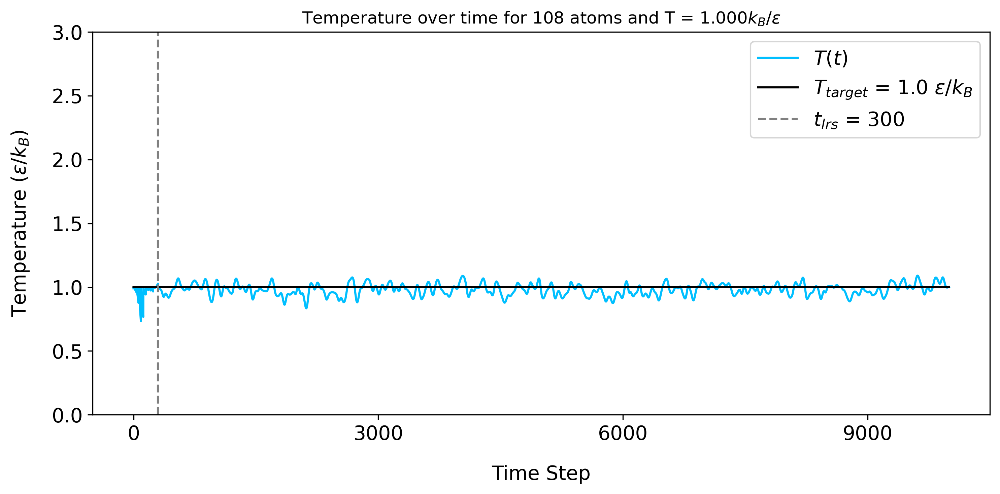
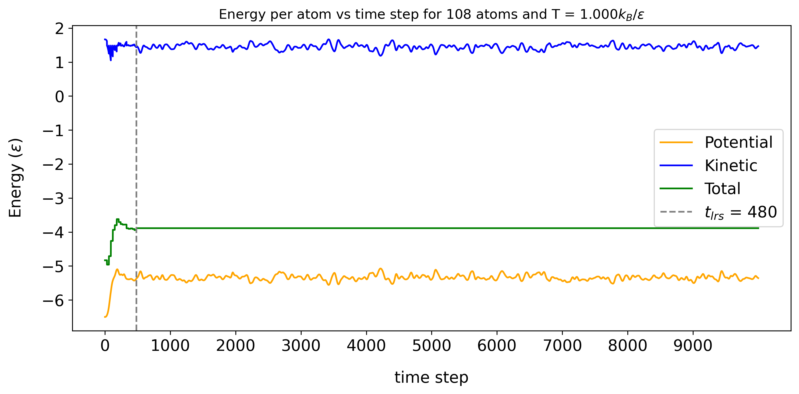
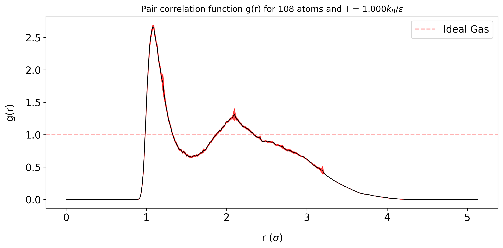
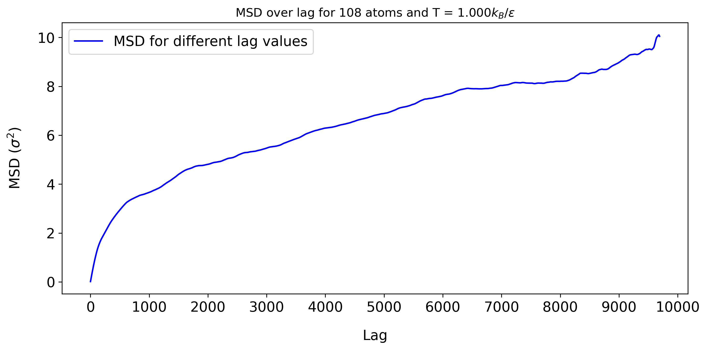

# TU Delft Computational Physics Project 1: Molecular dynamics simulation of Argon atoms
## Authors: Kyproula Mitsidi, Konstantinos Pourgourides

Welcome to our Molecular Dynamics of Argon project! This project simulates the motion and interactions between Argon atoms using a periodic FCC lattice and a Lennard Jones potential. Here, you can learn how to run the simulation yourself using the file `molecular_dynamics_argon_testing.ipynb`, and to calculate interesting physical observables!

<p align="center">
  
</p>

## Load the necessary modules

Firstly, run this cell to load all the necessary modules you'll need 

```
import molecular_dynamics_argon as mda 
import observables as obs
from IPython.display import display, Math
```

## Running the Simulation

You are at the point where you have to decide the conditions of the simulation, such at the temperature `temperature` $T$ and  `density` $\rho$! Additionally, you have to decide the integer value of `n`. This parameter is related to the length of the edges of our simulation box as $L = na$, where $a$ is the lattice constant of the FCC lattice of Argon. Therefore, it affects the number of atoms in the simulation, given by `num_atoms = 4*n**3`. Lastly, choose the number of total time steps `num_tsteps`!

> [!TIP]
> We recommend to run the simulation for the inputs listed below the first time. The plots you will see below correspond to these inputs.

```Python
density = 0.8
temperature = 1
n = 3
num_tsteps = int(10e3)
```

> [!WARNING]
> Combinations of density and temperature that lead to a very high energy gas might not rescale correctly.

> [!IMPORTANT]
> Density and temperature are in reduces units: $\rho \ [\sigma^{-3}], \quad  T \ [\varepsilon / k_B]$.

Run this cell to prepare the simulation with your previous inputs

```Python
mda.set_physical_constants(density,temperature,n)
mda.set_simulation_constants(num_tsteps) 
```

Run the next cell to run the simulation! The runtime of this cell depends on `n`. For low values (`n`< 3), you can expect the cell to run fairly quickly. For larger values, it takes more time! We recommend that the maximum value you use is `n=4`.

```Python
simulation = mda.simulate(rescale_period = 30, rescale_force = 150)
pos, ke, pe, temper, counts, virial, lrs = simulation
```

The outputs correspond to:

- atomic positions (`pos`) with `shape(num_atoms, num_tsteps, dim=3)` 
- kinetic energy (`ke`), potential energy (`pe`) and temperature (`temper`) with `shape(num_tsteps)`
- counts of pair-wise distances in each bin of $[r,r+\Delta r]$ with `shape(num_bins=500, num_tsteps)` (will be used for the calculation of pair correlation function)
- virial term in the definition of pressure with `shape(num_tsteps)` (will be used for the calculation of pressure)
- the last time step in which rescaling took place (`int`)

> [!NOTE]
> The variables `rescale_force` and `rescale_period` have to do with the velocity rescaling. For more information, you can take a look at the [report](https://gitlab.kwant-project.org/computational_physics/projects/Project1_kmitsidi_kpourgourides/-/blob/master/report/REPORT.pdf?ref_type=heads). For this run, these values will suffice.

## Results & analysis of observables

#### Check the velocity rescaling

Firstly, we want to check whether velocity rescaling was done correctly. If this step is not valid, the observables might have unnatural values. By running the cell below, you can see the time evolution of temperature pre- and post-rescaling, and see whether it fluctuates around the value you have set in the second cell.

```Python
obs.plot_temperature_evolution(temper, lrs)
```

<p align="center">
  
</p>

> [!TIP]
> If this step is not done correctly, you might need to adjust the values of `rescale_force` and `rescale_period`. Alternatively, your `density` and `temperature` inputs might lead to a very high energy gas which is hard to tame!

#### Energy evolution

By running the cell below you can visualize the time evolution of kinetic, potential and total energy per atom. If the rescaling step was done correctly, you should see the 3 energies abruptly change during the rescaling process, and finally settle and fluctuate around a constant value. Ideally, the total energy should look completely constant.

```Python
obs.plot_energy_evolution(ke, pe, lrs)
```

<p align="center">
  
</p>

#### Specific Heat

The first observable we can calculate is specific heat capacity

$$ \frac{\langle \delta K^2 \rangle}{\langle K \rangle^2} = \frac{2}{3N}
\left(1-\frac{3N}{2 C_V}\right) = \frac{2}{3N}
\left(1-\frac{3}{2 c_V}\right) $$

```Python
cv, cv_err = obs.get_specific_heat_capacity(ke, lrs)
display(Math(fr"c_v = ({cv:.3f} \pm {cv_err:.3f})\,k_B"))
```

#### Pressure

We can also calculate the pressure of our system

$$ \frac{\beta P}{\rho} = 1 - \frac{\beta}{3 N} \left<\frac{1}{2} \sum_{i,j} r_{ij} \frac{\partial U}{\partial r_{ij}} \right> $$

```Python
pressure, pressure_err = obs.get_pressure(virial, lrs)
display(Math(fr"p = ({pressure:.3f} \pm {pressure_err:.3f})\, \epsilon/\sigma^3"))
```

#### Pair correlation function

Next, we visualize the pair correlation function of the system! This plot has different shape for the different states of matter. You can read more about this in the [report](https://gitlab.kwant-project.org/computational_physics/projects/Project1_kmitsidi_kpourgourides/-/blob/master/report/REPORT.pdf?ref_type=heads)!

$$ g(r) = \frac{2V}{N(N-1)} \frac{\langle n(r) \rangle}{4 \pi r^2 \Delta r} $$

```Python
g = obs.plot_pair_correlation_function(counts, lrs)
```

<p align="center">
  
</p>

#### Mean Squared Displacement

Finally, we can visualize the mean squared displacement and get the diffusion coefficient! We expect this plot to grow linear (liquids) or have a plateau (solids) as time evolves

$$\langle \Delta^2\textbf{x}(t)\rangle = \langle \left[ \textbf{x}(t)-\textbf{x}(0) \right] ^2\rangle$$

```Python
d, d_err = obs.plot_msd(pos, lrs)
display(Math(fr"D = ({d/1e-5:.3f} \pm {d_err/1e-5:.3f})\times 10^{{-5}} \, \sigma^2/h"))
```

<p align="center">
  
</p>

#### Optional: Animation

Optionally, you can add the cell below to visualize an animation of the argon atoms interacting as their positions evolve in time!

```Python
from mpl_toolkits.mplot3d import Axes3D
from matplotlib.animation import FuncAnimation

ani = plot_position_evolution_animation(pos, save_plot='My Animation')
```

## The end

You have reached the end, thank you for following this guide on how to run our simulation!