# Weekly progress journal

## Instructions

In this journal you will document your progress of the project, making use of the weekly milestones.

Every week you should

1. write down **on the day of the lecture** a short plan of how you want to
   reach the weekly milestones. Try to be specific: Think about how to distribute work in the group,
   what pieces of code functionality need to be implemented, and set target deadlines.
2. write about your progress **until Monday, 23:59** before the next lecture with respect to the milestones.
   *Substantiate your progress with links to code, pictures or test results. Reflect on the
   relation to your original plan.*

We will give feedback on your progress on Tuesday before the following lecture. Consult the
[grading scheme](https://computationalphysics.quantumtinkerer.tudelft.nl/proj1-moldyn-grading/)
for details how the journal enters your grade.

In week 3, we ask you additionally to use the [team checklist](https://compphys.quantumtinkerer.tudelft.nl/planning_project/#team-checklist)
to reflect on how the group work is going, and how you could improve in the future.
(Note that the grade of that week does not depend on how the group functions - but we
can give you feedback that helps you!)

Note that the file format of the journal is *markdown*. This is a flexible and easy method of
converting text to HTML.
Documentation of the syntax of markdown can be found
[here](https://docs.gitlab.com/ee/user/markdown.html#gfm-extends-standard-markdown).
You will find how to include [links](https://docs.gitlab.com/ee/user/markdown.html#links) and
[images](https://docs.gitlab.com/ee/user/markdown.html#images) particularly
useful.

## Week 1
(due Monday, 16 February 2026, 23:59)

#### Planning

##### Code Functionality / Milestones

- [ ] **Develop a way to store each particle's velocity and position at every timestep**:

      We plan on using np.arrays or dictionaries to store this information. We will decide on this based on what works in harmony with the rest of the project.

- [ ] **Calculate the force on each particle using the Lennard-Jones potential**:

      Given the previous information we will construct a function which calculates the force as the negative gradient of the potential at each time step.

- [ ] **Implement the Euler method for time evolution**:

      
      We will create a loop over time to calculate the wanted quantities at each time step using the Euler's method. The information at each time step will be stored in the analogous object described in milestone 1.

- [ ] **Implement the periodic boundary condition**:

      
      We plan on creating a prototype cell in which the actual simulation takes place and then copy it around to implement the periodic BCs.

- [ ] **Define a function that calculates the total energy of the system**:

      We plan on creating a function that calculates all the pair-wise energy interactions, and then add all the pair-wise energy contributions using the appropriate formula.

    
##### Distribution of Work

- We plan on meeting in person and working in parallel to achieve the milestones. We will distribute the workload evenly
  as the project evolves.

##### Deadlines

- We plan on achieving the milestones until the end of the weekend.

#### Progress report

##### Milestones:

- [x] **Develop a way to store each particle's velocity and position at every timestep**:

      We realized that np.arrays were far more useful than dictionaries as they allowed us to vectorize many operations. We stored positions and velocities in np.arrays of shape (num_atoms, num_timesteps, dim), meaning that for each atom in the simulation there is a matrix, where each row corresponds to a different time step, and each column corresponds to a different dimension (e.g.: x,y,z).

      

- [x] **Calculate the force on each particle using the Lennard-Jones potential**:

      We calculated by hand the derivative of du/dr and incorporated it in the code as a matrix with shape (num_atoms, num_atoms-1). Having the relative distances, relative positions and du/dr for each particle we managed to calculate the components of the force for each particle corresponding to a fixed timestep.

      

- [x] **Implement the Euler method for time evolution**:

      Firstly, we created np.zero arrays with shape $(num_atoms, num_timesteps, dim)$ for initialization. Then, we copied the first row of each matrix from that of the `initial_pos` and `initial_vel` objects. Then, we implemented Euler's method with iterations over time. This gives us the position, velocity and force for each timestep.

      

- [x] **Implement the periodic boundary condition**:

      We implemented the periodic BCs in two different places, in the calculation of positions in Euler's algorithm and in the calculation of relative positions. For the positions, if the next iteration of Euler's algorithm displaced the particle to a position x_i > L in a particular dimension i, then the particle's position in that dimension was corrected as x_i - L. For the relative positions, we had to consider that the minimum distance between two particles i and j could be less than the mere difference of their coordinates, because the periodic boundary conditions can place one particle closer to the other. To incorporate this in our code, we checked the case where the distance of two particles in a direction is less than L/2 and the case where it is more than L/2. If we had the former case we replaced the actual relative position with -(L -(x_i -x_j)) and the latter with -(-L -(x_i -x_j)).

    

- [x] **Define a function that calculates the total energy of the system**:

      We have two functions, one for potential and one for kinetic energy. Then, the total of these quantities was calculated per time step, and finally they were time-averaged over all time steps in order to find the total energy of the system.

##### Testing/Results

We want to test the functionality of our whole simulation, but to do that we have to ensure that the partial functions work as expected.

> [!WARNING]
> The numbers you will see below representing physical variables have no meaning at the current stage and they just serve our testing purposes.

- **Check for `atomic_distances` function.**
  
We randomize the position for 2 atoms with `box_dim=1`:

```
         position
         
      x           y
[[0.12286052 0.60780938]  particle 1
 [0.71587696 0.2894693 ]] particle 2
 ```
When inserting the above data in the function `atomic_distances` we get two outputs, the relative position `rel_pos` and the distance `rel_dist` of the two particles: 

```
        relative position
        
    x_i-x_j         y_i-y_j
[[[ 0.40698357  0.31834008]]  i=1, j=2
 [[-0.40698357 -0.31834008]]] i=2, j=1
```
We see that the mere difference between the x-coordinates of the two particles gives an absolute value of approximately `0.6`, which is greater than `box_dim/2 = 0.5`, and so the real minimum distance is not given by this. The real relative positions for this direction are given by `L-0.6` and `0.6-L` which is exactly what is depicted on the table above. Thus, the periodic BCs seem to be applied correctly. For the mere difference between the y-coordinates, it is evident that the result is less than `0.5`, and thus no additional caclulations shall be made, which is again what it is shown on the table. Lastly, we observe that the relative positions of the first particle from the second are exactly opposite from those of the second particle from the first, as anticipated.

```
   distance
   
[[0.51669723]
 [0.51669723]]
```
The distance of the first particle from the second and that of the second particle to the first is exactly the same, as anticipated. Also, the values are correct.

- **Check for `lj_force`**.
  
Using the randomized positions above we get the following results:

```
              Force
              
      F_x              F_y
[[-4.95606799e-75, -3.87660630e-75], particle 1
 [ 4.95606799e-75,  3.87660630e-75]] particle 2
```

We observe that Newton's third law is satisfied, the addition of all forces in each dimension in the table above give 0.

- **Check the `simulate` function**.
  
We time evolve a single particle with a new randomized initial position and velocity using Euler's algorithm.

```
initial position for particle : [[0.22887447 0.66726098]]
initial velocity for particle : [[12.71181711 -5.45862447]]
```
We expect the particle to spawn at the initial position coordinate. The velocity vector has a positive x and negative y components, so we anticipate that the particle will start moving towards the bottom right area of the box. Once it comes close to the boundary, we expect to see it on the other side in the next time step.

<p align="center">
  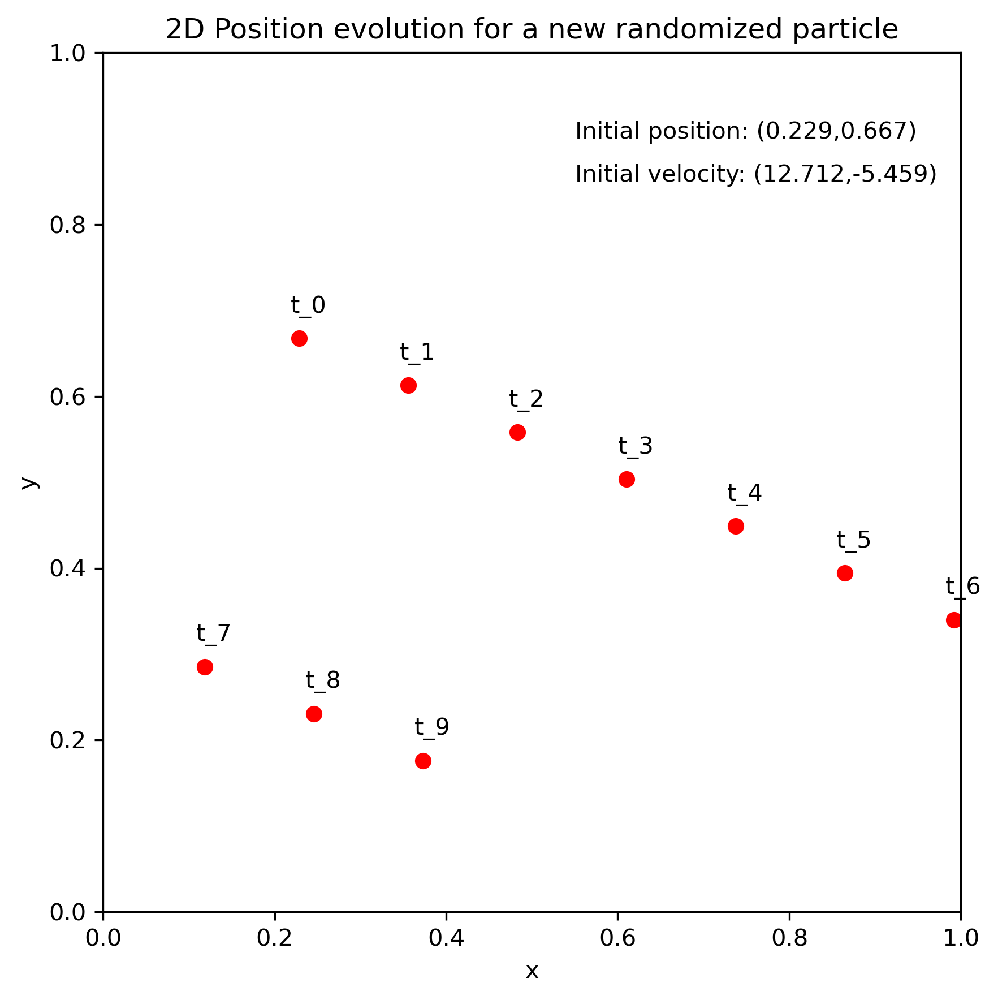
</p>

We observe the evolution of the particle for the different time steps. The velocity remains constant throughout the movement. We also see that the periodic BCs are correctly implemented.
   
#### AI disclosure

- [x] All the implemented ideas in our code are original thoughts of ours. In some cases, we didn't know which specific `numpy` commands to use in order to implement our ideas, so we used `chatGPT` to help us with that.


## Week 2
(due Monday, 23 February 2026, 23:59)

#### Planning

##### Code Functionality / Milestones

- [ ] **Derive the expression of the kinetic energy in dimensionless units**

      We are going to use the scaling technique we learned in the lecture.

- [ ] **Change your existing molecular dynamics simulation to now use dimensionless units**

      We are going to change all the relevant equations in the simulation using the scalings of the lecture.
          
- [ ] **Implement the minimal image convention**

      We already implemented this in the previous week, but we are going to check our code and make sure its
      correct as stated in the lecture.

- [ ] **Simulate 2 atoms in 3D space. Choose their initial positions close to the boundary. This way, you can clearly see if the periodic boundary conditions work. Plot their inter-atom distance over time. Furthermore, also plot the kinetic and potential energy, as well as their sum, over time.**

      We are going to implement the scalings to make our simulation dimensionless, and after checking that everything is calculated correctly, we are
      going to call the appropriate functions and plot what is asked.


##### Distribution of Work

- We plan on meeting in person and working in parallel to achieve the milestones. We will distribute the workload evenly
  as the project evolves.

##### Deadlines

- We plan on achieving the milestones until the end of the weekend.

#### Progress report

##### Milestones

- [x] **Derive the expression of the kinetic energy in dimensionless units**

      Below you can find our derivation which we implemented in the code.

$$T = \frac{1}{2}m\left[\frac{dx}{dt}\right]^2$$
$$T = \frac{1}{2}(\gamma m^*)\left[\frac{d(\alpha x^*)}{d(\beta t^*)}\right]^2 $$
$$T = \left[\frac{\gamma \alpha^2}{\beta^2}\right]\frac{1}{2}m^*\left[\frac{dx^*}{dt^*}\right]^2$$

      We remind the definitions of the constants

$$\alpha = \sigma, \quad \beta = \sqrt{\frac{m\sigma^2}{\varepsilon}}, \quad \gamma = m $$

      Finally,
         
$$\boxed{T = \varepsilon T^*}$$


- [x] **Change your existing molecular dynamics simulation to now use dimensionless units**

      We performed the calculations on how different physical quantities change when using dimensionless units and incorporated

      all necessary constants in the code (code cell "Scaling Constants").
 
      Also, in our simulation function, we prepared the final outputs (position, velocity, energy)

      to be in dimensionless units (code cell "Simulation").

> [!NOTE]
> We tried to directly link the relevant code lines, but it seems like we couldn't find a way to do this because we are working on a .ipynb file instead of .py. 

- [x] **Implement the minimal image convention**

      As we mentioned in the planning, we already implemented this last week (code cell "Atomic Distances"). You can find it in this part of our code:

      You can also see the implementation of this in practice in the animation below (specifically, you can see the red particle

      penetrating the top boundary and re-appearing in the bottom plane, and vice versa).

- [x] **Simulate 2 atoms in 3D space. Choose their initial positions close to the boundary. This way, you can clearly see if the periodic boundary conditions work. Plot their inter-atom distance over time. Furthermore, also plot the kinetic and potential energy, as well as their sum, over time.**

      We show what is asked above in the animation below.

<p align="center">
  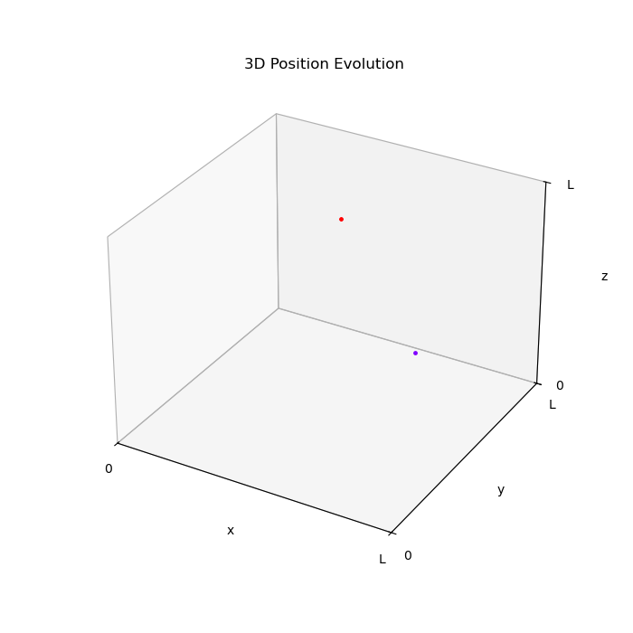
</p>

      We also present the following plots: Kinetic, Potential and Total energy vs time step, Atomic distances vs time step,

      and Potential energy vs atomic distances.

<p align="center">
  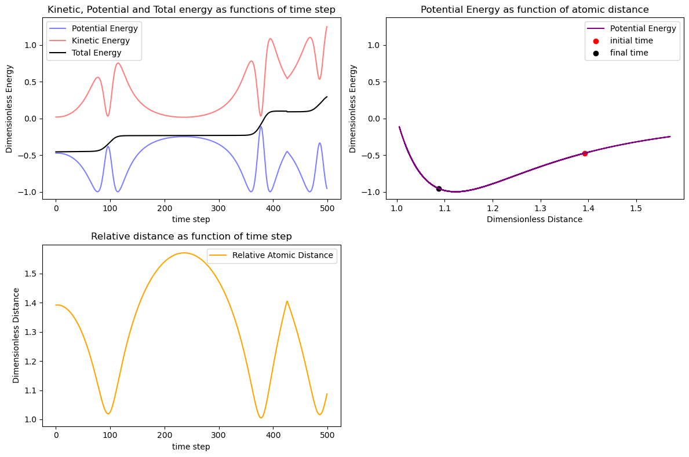
</p>

      Comments on the plots:
      
      Potential energy vs atomic distances: 
      
      We observe that this plot resembles the Lennard-Jones potential as we expect. We can see

      the distance at which the Potential energy is minimized (roughly 1.12 in dimensionless units). When the atomic distance is lower
      
      than this value, the atoms are mutually repulsed, whereas for slightly larger atomic distances they are attracted and for much
      
      larger atomic distances they dont feel each other's presence and hardly interact.
      

      Energy and atomic distance vs time: 
      
      We observe that our atoms are initially attracted and directed towards each other, thus, the potential energy is decreasing,

      the kinetic energy is increasing, and the atomic distance is also decreasing. While the atomic distance is decreasing, they start repulsing even though they are still

      directed towards each other (but are now decelerating), thus potential energy is increasing and kinetic energy decreasing. When the atoms finally come to a stop (zero velocity),

      they start moving away from each other due to the repulsive force, and thus the potential energy is decreasing, the kinetic energy is increasing as well as the atomic distance.

      Finally, when they are adequately far in order to escape the repulsion zone, they start attracting each other again while moving away from each other. Thus, potential energy increases,

      kinetic energy decreases and atomic distance increases. When the atoms finally come to a stop again, the attractive force directs them again towards each other and the pattern repeats

      it self. What we described above correpsonds to the behaviour shown in the plots in the interval [0,200] timesteps. The total energy is the addition of potential and kinetic energy. 

      Clearly, it is not conserved, as we expect with the Euler method. We look forward to fixing this by implementing a better time integration scheme next week.


#### AI disclosure

- [x] We used `chatGPT` to help us regarding the matplotlib commands for the animation, because we were not familiar with this task. All other code and ideas were original creations/thoughts of ours.


## Week 3
(due Monday, 02 March 2026, 23:59)

#### Planning

##### Code Functionality / Milestones

- [ ] **Extend your code to more than 2 particles.**:

      Our code is already constructed in such way to simulate N particles. We will run simulations of different number of atoms to make sure that we get reasonable results.

- [ ] **Implement the velocity-Verlet algorithm.**:

      We will incorporate the velocity-Verlet algorithm in our simulate function.

- [ ] **Investigate the conservation of energy in the system. Plot the evolution of the kinetic and potential energy, as well as their sum.**:

      
      We will get the energy results of the previous implementation and plot them over time to study their behaviour.

- [ ] **Compare the results of energy conservation using the Euler and Verlet algorithms.**:

      
      We will make two graphs, one using the Euler algorithm, and one using the velocity-Verlet aglorithm, so we can compare the two results and determine whether the result are as we expect (conservation in Verlet, non-conservation in Euler).

- [ ] **Make an initial attempt to structure your code properly.**:

      We plan on using a separate file for all simulation functions (skeleton.py) and modify the current file we are working on so that it is dedicated to simulation testing.

##### Distribution of Work

- We plan on meeting in person and working in parallel to achieve the milestones. We will distribute the workload evenly as the project evolves.

##### Deadlines

- We plan on achieving the milestones until the end of the weekend.


#### Progress report

##### Milestones

- [x] **Extend your code to more than 2 particles.**

      
      We have tested our simulation for different number of atoms and initial positions, to make sure that the BCs are satisfied and that the system remains stable under diverse conditions. Here we present an animation for 10 particles where we can see clearly the attractive/repulsive forces and the BCs being satisfied, as we can track each particle from their assigned colour.

<p align="center">
    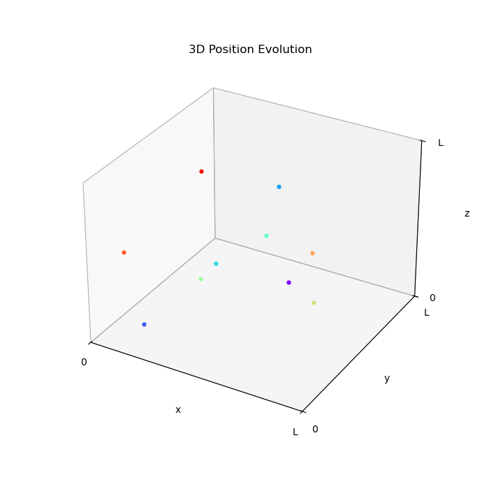
</p>

- [x] **Implement the velocity-Verlet algorithm.**

      
      We have implemented the velocity-Verlet algorithm as illustrated in the lecture notes of Week 3 in our Simulation.

> [!IMPORTANT]
> See the velocity-Verlet update step incorporated in the `simulate()` function [here](https://gitlab.kwant-project.org/computational_physics/projects/Project1_kmitsidi_kpourgourides/-/blob/master/skeleton.py?ref_type=heads#L76-86).
      
- [x] **Investigate the conservation of energy in the system. Plot the evolution of the kinetic and potential energy, as well as their sum.**

      
      We plotted the Kinetic, Potential and Total energy vs time step using Euler's algorithm and velocity-Verlet algorithm corresponding to the animation above. 

<p align="center">
    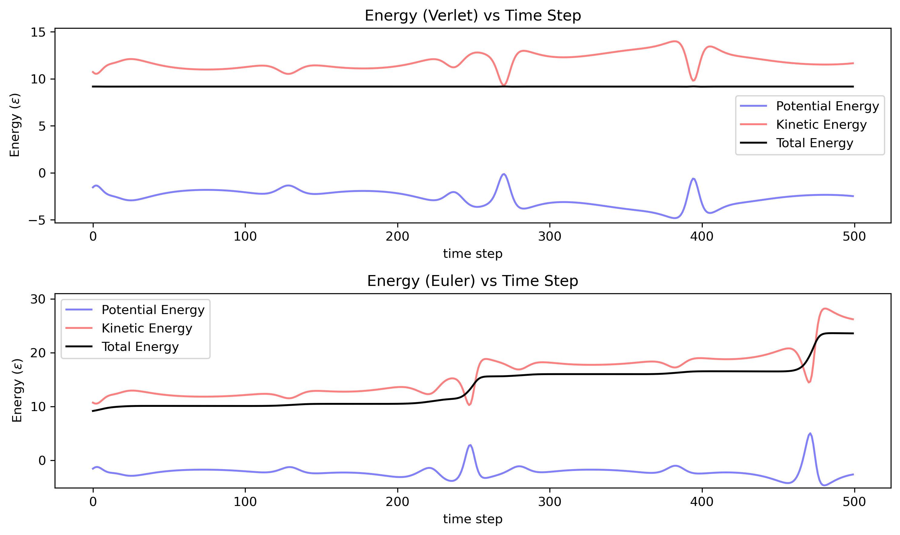
</p>

    To investigate further the conservation of energy we also plotted the Total energy vs time step, this time zooming in on the range of values it takes. We performed this analysis for both the Euler and velocity-Verlet algorithms in order to observe any fluctuations on this scale.

<p align="center">
    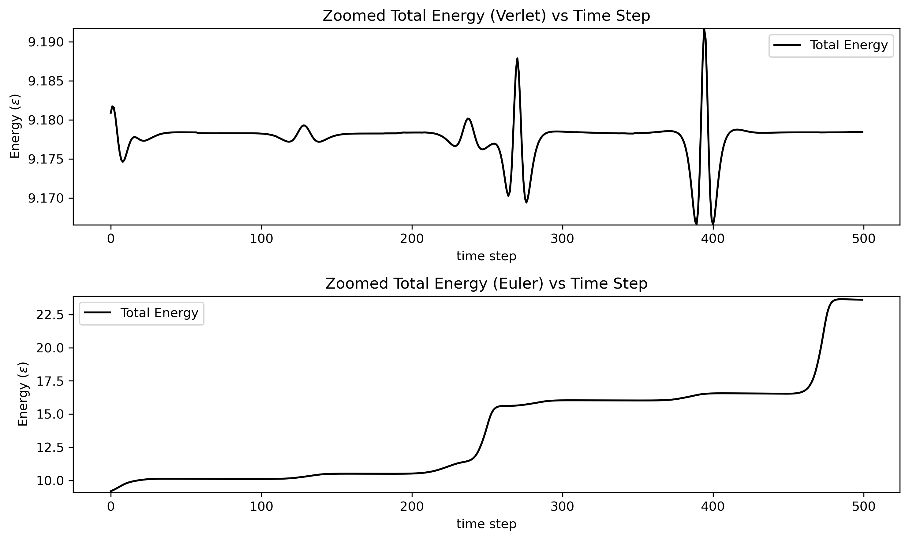
</p>

    Comments regarding the conservation of energy can be found under the next milestone.

- [x] **Compare the results of energy conservation using the Euler and Verlet algorithms.**

      
      From the first graph above we can make the following observations:

      - The potential and kinetic energy have opposite behaviours for both methods, i.e. when kinetic energy increases, potential energy decreases, and vice versa.

      - Velocity-Verlet algorithm: The total energy of the system remains stable around 9ε over time (we can see this from the straight line), indicating that energy is (approximately) conserved.

      - Euler's algorithm: The total energy of the system seems to have a gradual increasing trend over time, but the starting value is again close to 9ε.

      From the second graph we can make the following observations:

      - Velocity-Verlet algorithm: When zooming in, the total energy does not appear perfectly constant, as small fluctuations are visible while the system evolves. However, these fluctuations are very small relative to the overall energy scale. Therefore, when viewed on a larger scale, the total energy can be considered approximately conserved.

      - Euler's algorithm: When zooming in, the increasing trend over time is even more evident. The range of values it takes is steadily widening throughout the simulation, clearly indicating a systematic drift rather than small fluctuations around a constant value.

      These results are consistent with the conclusions from this week’s lecture: symplectic integrators, such as velocity-Verlet algorithm, are better at simulating Hamiltonian systems, as simpler techniques, such as Euler's algorithm, do not conserve the total energy.

      
- [x] **Make an initial attempt to structure your code properly.** 

      
      We have isolated all simulation functions in the skeleton.py file and we modified the file we have been working on so that it is dedicated to simulation testing. Also, a user has the possibility to modify the simulation parameters (e.g.: temperature, dimension, number of atoms, etc.) from the testing notebook without having to modify the source code.


#### Reflection on group work

We used the questions below to evaluate our teamwork and we discussed in person whether any changes to our working style were needed. Overall, we both feel that our current approach is efficient and aligns well with our schedules and individual working preferences.

- [x] **Are tasks done in time and meetings attended?**


      Yes, all tasks are done in time, as planned each Wednesday, and all meetings have been attended with no implications.
      
- [x] **Are all group members involved in decisions?**

      Yes, we are both involved in the decisions we take, as we discuss each step in detail and agree on a plan before moving forward.
- [x] **Are everybody's ideas taken into account?**

      Yes, we both express our ideas on how to achieve a milestone and we decide on what is more efficient for our simulation. We make sure that we learn from each other's way of problem-solving.

- [x] **Do group members contribute equally?**

      Yes, we divide the work when we finish the weekly planning and we usually work in parallel while we are together. Sometimes, when the task at hand is more difficult, we are coding together on a single device.

- [x] **Are the group members treated respectfully?**

      Yes, we always make sure that we treat each other respectfully and kindly.

#### AI disclosure

- [x] We did not use AI for this week's milestones.

## Week 4
(due Monday, 09 March 2026, 23:59)

#### Planning

- [ ] **Implement the initialization of positions onto an fcc lattice.**

      We plan on making a new function that initializes the positions of particles onto an FCC lattice. To do that we have to study how such a lattice looks like and determine the relation between the dimension L of the box, the number of atoms and lattice constant so that the FCC structure is possible. We aim to position first a small subset of the atoms which follow the core pattern of the FCC lattice and then replicate it around the space so that the process is simplified.
- [ ] **Show that the initial velocities obey a Maxwell-Boltzmann distribution.**

      We plan on taking the initial velocities of all particles, which are initialised by a Gaussian distribution, and make a histogram of them to see if the frequency they appear follows a Maxwell-Boltzmann distribution. We will first ensure that velocity initialisation is properly normalized and that there is no drift, i.e. average velocity is zero is all direcctions. 
- [ ] **Perform the rescaling of temperature and show how the desired temperature is attained after a certain amount of rescaling and equilibrating.**

      First, we have to think of how the rescaling is performed within a dimensionless environment and make appropriate modifications. We will introduce two new parameters, the rescaling time (number of time steps between each scaling check) and threshold (the maximum allowed energy difference between two consecutive timesteps to be considered equilibrium). At every rescaling-time interval we will be checking whether the threshold is satisfied, and in the case that it is the rescaling process will stop.
- [ ] **Study at least one observable, and compare its behaviour to literature.**

      We plan on studying some observables to ensure that our simulation works as expected. We will calculate the average of these observables using only data from the equilibrium point onward, and compare their behaviour to existing literature. If our results do not match, we will investigate potential errors in our code to improve it.

##### Distribution of Work

- We plan on meeting in person and working in parallel to achieve the milestones. We will distribute the workload evenly
  as the project evolves.

##### Deadlines

- We plan on achieving the milestones until the end of the weekend.

#### Progress report

##### Milestones


- [X] **Implement the initialization of positions onto an fcc lattice.**

      We wrote the coordinates of the unit cell of the FCC lattice and essentially translated it accross the different directions along the 3 dimensional simulation cell. Below you can see the initialization of atom positions on the FCC lattice for 256 atoms

<p align="center">
    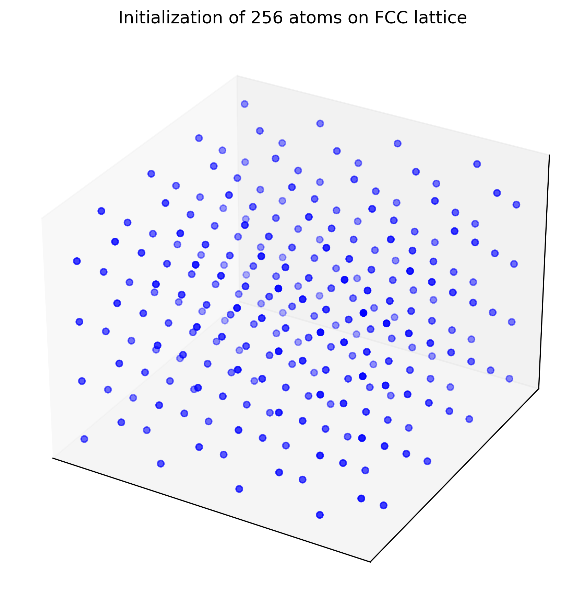
</p>

> [!IMPORTANT]
> See the position initialization incorporated in the `init_position()` function [here](https://gitlab.kwant-project.org/computational_physics/projects/Project1_kmitsidi_kpourgourides/-/blob/master/molecular_dynamics_argon.py?ref_type=heads#L375-402).
      
- [X] **Show that the initial velocities obey a Maxwell-Boltzmann distribution.**

      We plotted the initial velocities for 256 particles at 94.4K and plotted the theoretical Maxwell-Boltzmann curve above. From the plot below, you can see that they are in good agreement.

<p align="center">
    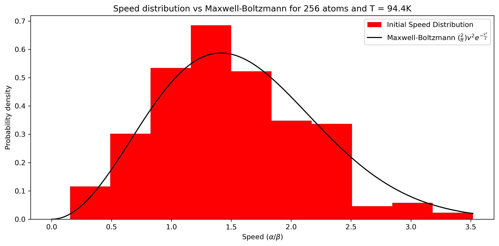
</p>

> [!IMPORTANT]
> See the velocity initialization incorporated in the `init_velocity()` function  [here](https://gitlab.kwant-project.org/computational_physics/projects/Project1_kmitsidi_kpourgourides/-/blob/master/molecular_dynamics_argon.py?ref_type=heads#L355-372)
      
- [X] **Perform the rescaling of temperature and show how the desired temperature is attained after a certain amount of rescaling and equilibrating.**

      In order to do this, we let the system undergo time evolution, and checked whether the temperature was within 5K of the target temperature every 50 iterations. If the temperature of the simulation was in good agreement (within 5K) with the target temperature for more than 150 timesteps, the rescaling was discontinued.
      The temperature is calculated as follows:

$$ T =  2\text{KE}/(3(N-1)k_B) $$

> [!IMPORTANT]
> See the rescaling process in the `rescale()` function [here](https://gitlab.kwant-project.org/computational_physics/projects/Project1_kmitsidi_kpourgourides/-/blob/master/molecular_dynamics_argon.py?ref_type=heads#L203) and the application of it in the `verlet()` function [here](https://gitlab.kwant-project.org/computational_physics/projects/Project1_kmitsidi_kpourgourides/-/blob/master/molecular_dynamics_argon.py?ref_type=heads#L122-200).

      Below you can see the rescaling of the temperature it self in a plot with the ratio of the simulation temperature and the target temperature (94.4K) over time for 256 atoms. As shown, after the condition stated above was satisfied, rescaling stopped and the simulation temperature kept fluctuating around the target value for the rest of the simulation.

<p align="center">
    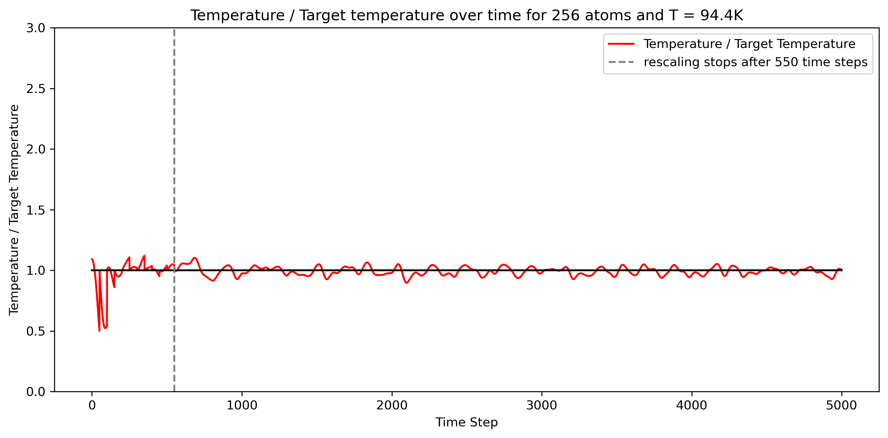
</p>

    You can also see the plot of the potential, kinetic and total energy per atom for 256 atoms at target temperature 94.4K. Initially, some abrupt steps are observed due to the rescaling, but eventually the energy curves smoothen out as the system reaches equillibrium.

<p align="center">
    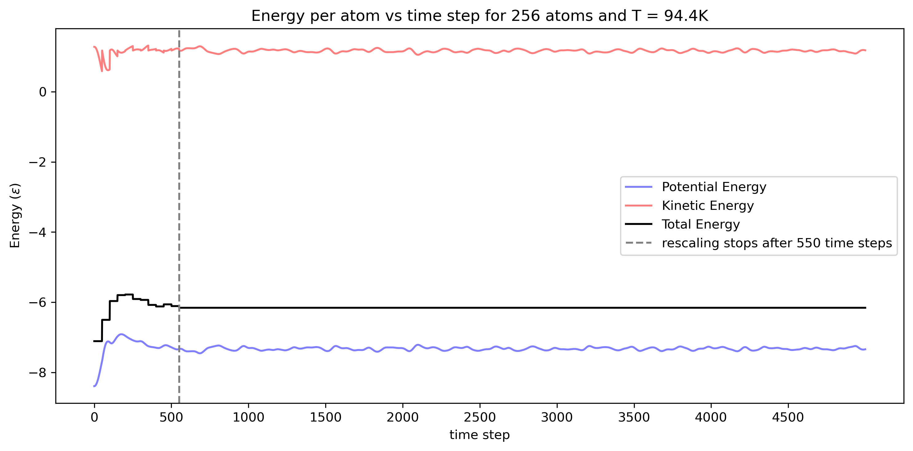
</p>
      
- [X] **Study at least one observable, and compare its behaviour to literature.**

      We studied the pair correlation function g(r) which is basically a distribution of particle distances and their relation to the uncorrelated particle distances observed in the ideal gas (g(r)=1).

      We expect to see peaks in common particle distances (for example nearest neighbour pairs in an FCC lattice), and dips in very small distances (where Lennard-Jones potential prevents particles from coming close together) and very big distances (because of the minimal image convention).

      Below you can see a plot of the pair correlation function g(r) for 256 atoms at 94.4K target temperature (liquid phase). You can see abrupt peaks at approximately 3.7, 6.9 and 10.1 Angstrom, which correspond to nearest, second-nearest and third-nearest neighbours.

      As expected, there are dips at very short and very large distances.

<p align="center">
    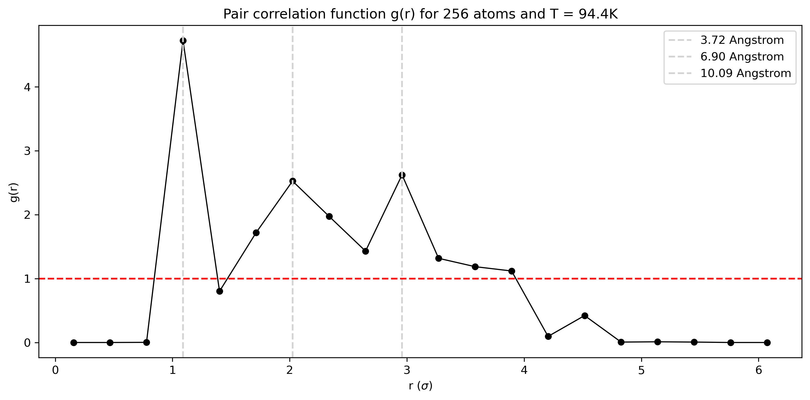
</p>

    Our observations match that of 

Rahman, A. (1964), *Correlations in the motion of atoms in liquid argon*, Physical Review, **136(2A)**, A405–A411. https://doi.org/10.1103/PhysRev.136.A405

    which is one of the cornerstone papers on liquid argon MD simulation. As you can see in FIG. 2 of the paper, the peaks of the g pair correlation function are approximately the same. Slight difference in the shape of function might be due to the different number of atoms in the simulation, as well as other simulation constants. The temperature is set at 94.4K to match that of the paper.

Below you can see the animation corresponding to all of the plots above

<p align="center">
    
</p>

#### AI disclosure

- [x] We used `chatGPT` to help us make the initialization on the FCC lattice. Additionally, we used it to help us vectorize parts of the function `atomic_distances`, which otherwise used several loops and prevented us from making simulations with many atoms or for long time periods due to inefficiency.

## Week 5
(due Monday, 16 March 2026, 23:59)

#### Planning

- [ ] **Implement calculation of errors and test your implementation on data with a known correlation time.**

      We will implement the calculation of errors using the procedures in the lecture for each obsevable accordingly. 
- [ ] **Compute observables including errors.**
   
      We will try to calculate all observables that are not yet estimated by our code: pressure, specific heat and diffusion. All observables will be accompanied with the relevant error.
- [ ] **Make sure your code is structured logically.**

      After implementing all necessary functions, we will review our code as a whole and make the structure clear with intuitive docstrings. We will remove any unnecessary calculations and rename any functions/variables/parameters that do not conform to our chosen format. We will organize our code so that all procedures are incorporated  in a consistent manner.
- [ ] **Make a plan for simulations to go into the report: How do you want to validate your simulation, and which observables/simulations do you want to run?**

      We will review the literature on similar simulation studies and, if possible, run the relevant simulations by adjusting the parameters. We will then compare all available observables and calculate additional ones where possible, as reported in the available studies. We will also test our simulation on simple cases where the expected behaviour is known. 
- [ ] **Make a brief statement about the efficiency of your code: can you run the simulations you would like to do? Would it make sense to improve performance?**

      We will evaluate the limits of our code by measuring the runtime of different simulations and assessing whether meaningful results are obtained. Keeping the number of atoms fixed, we will vary the time step to determine for which parameter values the simulation produces reliable results within a reasonable computational time. It would make sense to improve performance if the cababilities of our code are very limited and the desired simulation runs are not possible.

##### Distribution of Work

- We plan on meeting in person and working in parallel to achieve the milestones. We will distribute the workload evenly
  as the project evolves.

##### Deadlines

- We plan on achieving the milestones until the end of the weekend.

#### Progress report

- [X] **Implement calculation of errors and test your implementation on data with a known correlation time.**

      We incorporated in our code the provided function for producing fake data with a known correlation time. We created the autocorrelation function as
      
      described in the lecture and tested it on a random sample produced from the fake data function. Below you can see the implementation for fake data
      
      with known correlation time = 50.

<p align="center">
    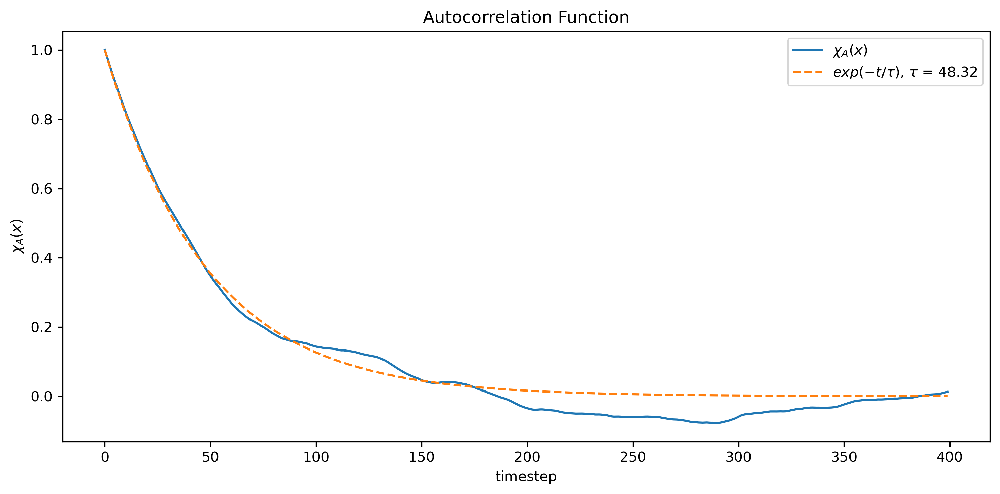
</p>

    The correlation time is calculated accurately by our code.

> [!IMPORTANT]
> See the implementation of autocorrelation function [here](https://gitlab.kwant-project.org/computational_physics/projects/Project1_kmitsidi_kpourgourides/-/blob/master/observables.py?ref_type=heads#L46-148).
      
- [X] **Compute observables including errors.**

      We have succesfully computed all observables: pair correlation function, pressure, specific heat and diffusion coefficient accompanied with their
      
      errors. Below you can find the relevant plots, calculations and links to respective code.

Pair correlation function

<p align="center">
    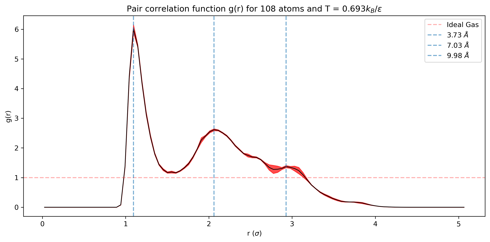
</p>

> [!IMPORTANT]
> See the implementation of pair correlation function [here](https://gitlab.kwant-project.org/computational_physics/projects/Project1_kmitsidi_kpourgourides/-/blob/master/observables.py?ref_type=heads#L340-406).

    The pair correlation function is plotted with the respective error band which has been found using the autocorrelation function and error propagation for each bin.

Pressure

    For 108 atoms and temperature 0.69Kb/epsilon (83K) we find 
    
$$ p = (-1.5393 \pm 0.155)  (\epsilon/\sigma^3) $$

    The error was found using the autocorrelation function and error propagation.


> [!IMPORTANT]
> See the calculation of pressure [here](https://gitlab.kwant-project.org/computational_physics/projects/Project1_kmitsidi_kpourgourides/-/blob/master/observables.py?ref_type=heads#L409-436).

Specific heat

    For 108 atoms and temperature 0.69Kb/epsilon (83K) we find 
    
$$ c_v = (4.670 +- 2.000) k_B. $$
    
    The error was found using the bootstrap method in combination with the autocorrelation function.


> [!IMPORTANT]
> See the calculation of specific heat [here](https://gitlab.kwant-project.org/computational_physics/projects/Project1_kmitsidi_kpourgourides/-/blob/master/observables.py?ref_type=heads#L476-511).
> See the implementation of the bootstrap method [here](https://gitlab.kwant-project.org/computational_physics/projects/Project1_kmitsidi_kpourgourides/-/blob/master/observables.py?ref_type=heads#L151-209).

Diffusion coefficient

<p align="center">
    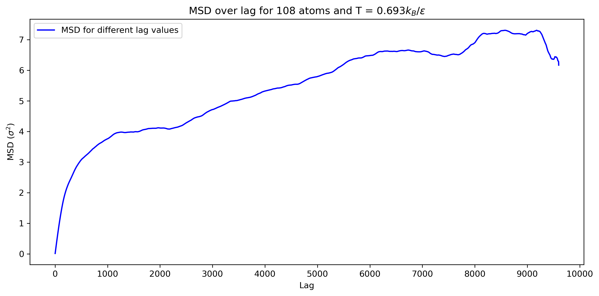
</p>

> [!IMPORTANT]
> See the calculation of diffusion coefficient [here](https://gitlab.kwant-project.org/computational_physics/projects/Project1_kmitsidi_kpourgourides/-/blob/master/observables.py?ref_type=heads#L513-578).

    The mean squared distance over different time lags is plotted for liquid form of argon. We can see the linear regime for large time lags. The diffusion
    
    coefficient has been found using the last point of the graph where the timescale is long compared to the typical interaction time. 
    
    The Diffusion coefficient is
    
$$ D = (10.707 \pm 17.387) \times 10^{-5} (\sigma^2/h) $$

    
- [X] **Make sure your code is structured logically.**

      We have structured our code in 2 files, one for hosting all the modules relevant to the functionality of the simulation, and another one that

      hosts the modules that calculate observables, errors and makes plots. Every function contains detailed docstrings explaining what they do and their

      parameters/outputs.

      
- [X] **Make a plan for simulations to go into the report: How do you want to validate your simulation, and which observables/simulations do you want to run?**

      We will review the literature on similar simulation studies and, if possible, run the relevant simulations by adjusting the parameters.

      We will then compare all available observables and calculate additional ones where possible, as reported in the available studies.

      We will also perform correctness checks (periodic bcs, maxwell-boltzmann distribution of initial velocities, correct fcc lattice initialization, rescaling process etc.)
      
- [X] **Make a brief statement about the efficiency of your code: can you run the simulations you would like to do? Would it make sense to improve performance?**

      Recently we made large improvements on the efficiency of our code by reducing redundant data storage. It can run quickly for the simulations we want

      (100-200 particles for more than 10k time steps). We even tested for 864 particles for 10k timesteps and it could still handle it, but surely more

      slow. For the simulations we want to make for the report, the efficiency is good.

      We will make improvements where needed (if needed), but we already vectorized most of our code where we would already.

      The only thing that does not run very quickly is the observable mean squared displacement and we will try to improve the efficiency before the end of the project.


#### AI disclosure
- [X] We used `chatGPT` for some commands of the `numpy` and `random` libraries, in order to implement our own ideas.


## Reminder final deadline

The deadline for project 1 is **Tuesday, 24 March 2026, 23:59**. By then, you must have uploaded the report to the repository, and the repository must contain the latest version of the code.